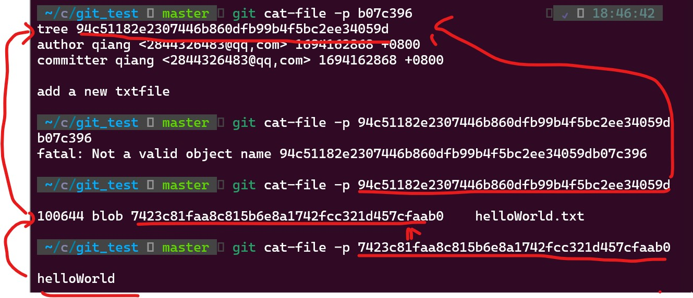

git的底层原理：


<font color = orange> 强烈推荐 </font>教学视频：[[自制双语字幕] 计算机教育缺失的一课(2020) - 第6讲 - 版本控制(Git)_哔哩哔哩_bilibili](https://www.bilibili.com/video/BV1Wh4y1s7Lj/?spm_id_from=333.999.0.0&vd_source=db6d2203c2a862f2952bc7180d665d24)

<font color = orange> 强烈推荐 </font> 参考书籍：[Pro Git](https://git-scm.com/book/en/v2)

参考文档：[一文讲透 Git 底层数据结构和原理 - 知乎 (zhihu.com)](https://zhuanlan.zhihu.com/p/142289703)

  git工作流：


# git的常用命令:

   `灵活运用用git help命令`

## 设置名字和邮箱（一般只用设置一次）

当新环境第一次使用git输入cmmit等命令时会报错并提示设置名字邮箱

可用`git config --global user.email "you@example.com"`和`git config --global user.name "Your Name"` 分别设置邮箱和名字

`0-1`


## 初始化空的git本地仓库：git init


此时若是输入`ls .git`会列出其中的文件，其中`object`和`refs`文件夹分别存储git树的“对象”和“引用”，即所有仓库数据会放在这两个文件下，十分重要。


## 查看仓库状态：git status


此时提示没有任何提交，当我们创建一个文件并向其中写入内容，再查看状态：

`2-4`


提示我们工作区有了helloWorld.txt文件，但git并没有追踪`Untrack`它，也称作没有存放到暂存区。

## 追踪文件/将文件添加到暂存区：git add "文件名"

`2-5`


此时再次status查看仓库状态会发现文件名字变绿了，即此文件处于暂存区（git开始跟踪此文件）

- `git add :/` 把所有更改添加到暂存

但`No commits yet`提示我们还未有文件提交到本地git仓库

## 将暂存区的文件提交的本地仓库: git commit

当我们输入git commit后会将暂存区内的文件全部提交到本地仓库

`2-6`


会打开我的编辑器，此时我们可以在此输入有关的提交信息，以便我们自己或者合作者了解提交了什么

`2-7`


保存退出，git返回提示，其中标红的是我们自定义的提交信息，`b07c396`则是我们在仓库中新建的节点的哈希值，每个节点有它唯一对应的哈希值。

`2-8`


- `git commit -a`：提交所有更改

## 查看文件内容：git cat-file

若是想详细查看该提交信息，可以使用`git cat-file -p "文件名/节点的哈希值"`来查看（）

其中`-p`参数表示根据文件类型进行打印

可以对返回的哈希值不断深入查看内容

`2-9`



```
关于git暂存区和本地仓库的区别：

1. 暂存区（Staging Area）：

- 暂存区是在工作目录和本地仓库之间的一个中间区域。
- 将文件添加到暂存区意味着告诉Git要将这些文件的更改包括在下一次提交中。
- 暂存区允许选择性地添加和提交文件的更改，而不是一次性提交所有更改。
- 通过将文件添加到暂存区，可以构建一个新的提交（commit），
  该提交将包含所有已添加到暂存区的更改。

2. 本地仓库（Local Repository）：

- 本地仓库是Git存储项目的完整历史记录的地方。
- 当使用 git commit 命令时，Git将暂存区中的更改保存到本地仓库中，创建一个新的提交。
- 本地仓库包含了项目的所有版本历史记录，每个提交都有一个唯一的哈希值，
  可以使用这些哈希值来访问特定版本的项目。
- 本地仓库是一个完全独立于远程仓库的存储，允许在本地进行版本控制和历史记录管理。

总结起来，暂存区是一个用于准备提交的中间区域，允许您选择性地添加和提交文件的更改。
而本地仓库是包含项目完整版本历史记录的存储库。
```

## 查看提交日记：git log

`2-10/2-11/2-12`


日记会用编辑器打开,按`q`退出。

一个提交的情况：


两个提交的情况：


*`git log` 后面还可以添加不同的参数以呈现不同的效果

默认不用任何参数的话，git log 会按提交时间列出所有的更新，最近的更新排在最上面。

`2-13` git log --all --graph --decorate


### git log 的常见参数：

- `--all` 查看全部日记

- `--graph` 以图表的形式显示

- `--decorate`显示指向每个提交的引用

- `--oneline` 将每个提交压缩成一行，更整齐

- %H 　提交对象（commit）的完整哈希字串  

- %h 　提交对象的简短哈希字串  

- %T 　树对象（tree）的完整哈希字串  

- %t 　 树对象的简短哈希字串  

- %P 　父对象（parent）的完整哈希字串  

- %p 　父对象的简短哈希字串  

- %an   作者（author）的名字  

- %ae   作者的电子邮件地址  

- %ad   作者修订日期（可以用 -date= 选项定制格式）  

- %ar    作者修订日期，按多久以前的方式显示  

- %cn    提交者(committer)的名字  

- %ce    提交者的电子邮件地址  

- %cd    提交日期  

- %cr     提交日期，按多久以前的方式显示  

- %s      提交说明

- -p 　　　　按补丁格式显示每个更新之间的差异。  

- --stat   　　显示每次更新的文件修改统计信息。  

- --shortstat 　　只显示 --stat 中最后的行数修改添加移除统计。  

- --name-only 　　仅在提交信息后显示已修改的文件清单。  

- --name-status 　　显示新增、修改、删除的文件清单。  

- --abbrev-commit 仅显示 SHA-1 的前几个字符，而非所有的 40 字符。  

- --relative-date 　　使用较短的相对时间显示（比如，“2 weeksago”）。  

- --pretty 　　使用其他格式显示历史提交信息。可用的选项包扩oneline，short，full，fuller 和 format（后跟指定格式）。

- -n 　　仅显示最近的 n 条提交  

- --since, --after 　　仅显示指定时间之后的提交。  

- --until, --before 　　仅显示指定时间之前的提交。  

- --author 　　仅显示指定作者相关的提交。  

- --committer 　　仅显示指定提交者相关的提交。

```git
示例：
git log <file> # 查看该文件每次提交记录

git log -p <file> # 查看每次详细修改内容的diff

git log -p -2 # 查看最近两次详细修改内容的diff

git log --stat #查看提交统计信息
```

## 检出（改变当前工作节点）： git chekout {需要检出（移动到）的某个节点（提交）的哈希值}

一般得配合日记来使用

`2-12`


此时我们当前工作的节点（HEAD）是（master）是第二个节点，当我发现此节点出现bug，想回到上一个节点可使用chekout检出第一个节点：

`2-14`

此时查看日志可发现，当前工作状态指针(HEAD)回到了第一次提交处。

同理回到后边节点的操作：

- 注意此时`log` 要加上参数`--all`,因为无参的log命令只会显示工作节点之前的日志

`2-15`


> <font color = orange> 注意！checkout是一个带有危险性的命令，当对较前的节点进行改动后会销毁后边的原本的提交。若是不想销毁原本后面的提交可使用`git checkout -f {后边节点哈希值}` 这会强制检出后边的提交，并放弃改动 </font>

还可以使用`git checkout {分支名}`检出不同分支或回到分支最顶端

或`git checkot {文件名}`将某未暂存文件切换回HEAD快照的状态

## 检查工作区和之前工作节点/不同节点之间的差异： git diff

([Git diff 命令——如何比较你的代码中的变化 ](https://www.freecodecamp.org/chinese/news/git-diff-command/)) 

1. 直接使用`git diff`会比较当前工作区修改的内容和当前本地仓库（HEAD）的差异（即目前相比仓库修改了什么文件目录）
   
    相当于`git diff HEAD`
   
   `2-16`
   
   
   
   其中git将旧版本命名为a以减号指代，新版本命名为b以加号指代。红色表示减少的文件，绿色表示增加的文件，其前面的加减号表示是在哪个文件里的(a/b文件)

2. 使用`git diff {文件名}`可比较当前工作区修改的某个指定文件内容和当前本地仓库工作节点的差异
   
   *比较的是工作区的修改，若是使用了 git add 在 显示差异则没有输出*

3. `git diff {某节点哈希值}`可显示当前工作区和指定节点内容的差异，若工作区没有修改，则显示当前工作节点和指定节点的差异。  同理后面可跟指定的文件。

4. `git diff {a节点的哈希值} {b节点的哈希值}` 比较a、b快照的差异
   
   ### 
   
   ### diff的一些参数
- `git diff --stat` 显示摘要而非整个 diff

-  `git diff --cached` 查看已缓存的改动

- `git diff > {文件名}`将差异重定向输出到文件

# 分支和合并

## `git branch`

1. 直接使用git branch 打印所有分支，加上 `-vv` 参数可显示更多信息
   
   `3-1`
   
   

2. `git branch {名字}` 新建一个分支
   输入命令`git branch cat` 后会生成cat 分支，但目前HEAD依然指向master分支，搭配`git checkout cat`可以使HEAD指向cat分支
   
   `3-2`
   
   

此时进行些修改再进行查看

`3-3`

c

将HEAD切回master主分支并开创dog分支

`git checkout -b dog`        `-b`可以直接创建分支并转到新分支

此时再将文件进行和cat不一样的修改并查看

`3-4`


此时cat、dog是两条平行的开发线了，可以各自在其上面开发或修bug，互不影响

## 合并分支：`git merge`

当在不同的分支上完成了工作，可以使用merge将不同分支上的内容合到一起，比如dog的开发需要先将cat的内容合过来，或者将cat和dog的内容合到master主分支上。

演示第二种情况：

先将HEAD检出到master分支，然后使用`git merge cat`

`3-5`


此时查看分支会发现

`3-6`


master前进到了cat的位置，这是一个很有趣的结果。

> 因为cat是原本是以master快照为基础得来的，当cat和master和并时，git很巧妙地直接将masteer指向了cat的提交

接下来同样将dog分支合并到master

`3-7`


会发现报错了，并提示在animal.py文件中产生了冲突。

因为master和dog处在两条平行的分支，在animal.py中的同一行两个分支有不同的内容，git无法分辨该如何修改，此时则需要我们手动解决冲突

> 若想取消这次合并， 可使用`git meerge --abort` 来回到合并前的状态

## 解决冲突

### 直接用编辑器打开产生冲突的文件

`3-8`


`3-9`


文件标识表示起了冲突的位置，此时我们可以手动编

退出后重新添加修改的文件到暂存区`git add animal.py` 并使用 <font color=orange> git merge --continue </font> 来继续合并

`3-10`


重新查看分支树会发现HEAD链接了cat和dog并向前走了一步

`3-11`


### 使用花哨的mergetool合并工具来解决冲突

# 远程仓库

## 登录github账户

为本地Git仓库和GitHub仓库之间的传输是通过SSH加密传输的，GitHub需要识别是否是你推送，GitHub只要知道了你的公钥，就可以确认你的身份，所以需要配置ssh key。（相当于登录GitHub账号）

### 1.创建SSH Key (ssh 公钥)。

ssh key存储在用户主目录（C:\Users\Administrator\.ssh 或 ~/.ssh）下，如果存在，再看.ssh文件夹下有无id_rsa和id_rsa.pub这两个文件，id_rsa.pub即是公钥,而id_rsa是私钥。

（windows下可打开git bash 而不是windows terminal）

若已有公钥可以用`cat ~/.ssh/id_rsa.pub`查看公钥

若无可以使用`ssh-keygen -t rsa` 生成ssh公钥

- 可能需要不断回车

- 如果已有公钥会自动覆盖

### 2.接下来到GitHub上，打开“Settings”--“SSH and GPG Keys”页面，然后点击“New SSH Key”，填上Title（随意写），在Key文本框里粘贴 id_rsa.pub文件里的全部内容。

每台想要登陆某个github账号的主机都需要有一个对应的key，例如你有一个github账号，你在你的笔记本和台式上都要创建key。 

### 3.验证登录`ssh -T git@github.com`

若看到 hi + 用户名说明密钥验证通过了，成功链接上了github账号

## `git remote` :查询当前仓库链接的所有远程仓库

无参命令会简洁显示所有仓库的名字，若是想详细看到仓库地址，可用以下命令

`g8it remote -v`

## `git remote add <自定义仓库名称> <仓库地址或ssh链接>`

若是仓库想修改仓库名称可使用`git remote rename <旧名称> <新名称>` 来修改仓库名称

`4-1`


## `git push` :推送本地分支到远端仓库

`git push <remote 远端仓库名> <local branch 本地分支名>:<remote branch 要推送到的远端分支名>` 

若远端无此分支则会新建给分支

 `4-2`


进入远端仓库可看到新建了master分支并多了文件

`4-3`


## 跟踪/关联远程分支

每次进行推送时总需要输入一长串命令，为方便我们可以将本地一分支跟踪到远端的某分支，当需要推送时直接输入`git push`即可。

设置跟踪分支常用以下几种方法：

### 1.`git banch --set-upstream-to=` 手动建立跟踪关系

`git banch --set-upstream-to=<remote/remote branch 远端名/远端分支名> <local branch 本地分支名>`

`4-4`


### 2.`git push -u <remote远程仓库名> <本地分支名>` push时建立跟踪关系

这样在push时，本地分支就和远程主机的同名分支建立追踪关系。

## 3. `git checkout -b <本地分支名> <远程主机名>/<远程分支名>` 在新建分支时建立跟踪关系

这样在新建一个本地分支时直接和远端分支建立跟踪关系。

### 4.`git branch --track `

`git branch --track <本地分支> <远端名>/<远端分支>`会新建一个本地分支并将其跟踪到远端分支

`git branch --track <远端名>/<远端分支>` 会将当前分支跟踪到远端分支

`4-5`


建立跟踪分支后查看分支树，会发现出现了红色的origin/master，这便是当前跟踪到的分支。

> 使用`git clone`克隆仓库时会自动建立master分支，并自动跟踪远端仓库的master分支

## 停止跟踪分支

`git branch --unset-upstream`可用来停止当前分支的跟踪

## `git clone`:将云端仓库克隆到本地

`git clone <远端仓库的url> <本地仓库的位置>`这会将远端仓库的内容和所有的分支树（提交记录）一起克隆到本地。

但当克隆一个大仓库时速度会变慢，此时可加上`--shallow`参数不克隆完整的提交记录,而是只克隆最新的快照。

`git clone --shallow <远端仓库的url> <本地仓库的位置>`

## 将远端仓库拉取到本地

在合作开发中可能有别的开发人员修改了远端仓库的内容，此时直接push会发生错误，因此需要先将远端仓库拉取下来和本次仓库进行合并。

拉取常用`fetch`he `pull`两种命令

### `git fetch`

当只有一个远程仓库时可直接使用`git fetch`

否则需指定拉取的仓库`git fetch <remote 远程仓库名>`

或者`git fetch <remote>/<branch>`拉取某仓库的某分支

> 注意！fetch是将远端分支拉到分支树里，并不是拉到HEAD节点，因此工作区还是没有改变，这时需要在将其合并`git merge <remote 仓库名>/<branch 分支名>`

### `git pull`

`git pull <remote 仓库名> <remote branch远端分支>:<local branch本地分支>` 拉取回远程主机某个分支的更新，再与本地的指定分支合并。

> pull 相当于 fetch + merge, 因此使用pull后工作目录即和远端一样

### fetch 和 pull 的区别

`4-6`


1. git fetch

在拉取代码过程中，git fetch会首先检查本地仓库和远程仓库的差异，检查哪些不存在于本地仓库，然后将这些变动的提交拉取到本地。

但是，这里请注意，它是把远程提交拉取到本地仓库，而不是本地工作目录，它不会自行将这些新数据合并到当前工作目录中，我们需要继续执行git merge才会把这些变动合并到当前工作目录。

2. git pull

git pull和git fetch刚好相反，它直接获取远程的最新提交，直接拉取并合并到本地工作目录，而且在合并过程中不会经过我们的审查，如果不仔细检查，这样很容易遇到冲突。

相比之下，git fetch是一个更安全的选择，因为它从远程仓库拉入所有的提交，但不会对本地文件做任何修改。

这给了我们足够时间去发现远程仓库自从我们上次拉取后到现在为止发生的变化。

因此我们可以在合并前检查哪些文件有变化，哪些文件可能导致冲突。

而git pull相当于运行git fetch，然后立即将你的改动合并到本地仓库。

这样的确少了一个步骤，但是也会带来一些风险。

# 其他一些提到但不详解的git功能

## `git config`

这是git的本地配置，上文的mergetool便是在此配置的。

可使用`git config ...`添加配置

或`vim ~/.gitconfig`用编辑器编辑配置文件

## `git stash` 回到上一提交状态

使用该命令将回退到上一提交新状态，但原本的提交并不是被删除，而是隐藏到某处，使用`git stash pop`将重新显示

## `git blame <file name 文件名>`追溯一个指定文件的历史修改记录

该命令会展示某文件每一行是由谁更改的

其中具体显示方式是：

commit ID (代码提交作者 提交时间 代码位于文件中的行数) 实际代码

## 

## `git bisect`搜索某个指定提交

原理是自动用二分查找，找到一个符合的提交记录

## .gitnore  文件

编辑这个文件可以让git自动忽略某些文件的改动，如自动忽略 .o 等文件
